# 🚀 AI-Powered Interactive Portfolio

<div align="center">


[](https://your-portfolio-url.com)
[](https://fastapi.tiangolo.com)
[](https://developer.mozilla.org/en-US/docs/Web/JavaScript)
[](https://python.org)
[](LICENSE)

**A modern, intelligent portfolio featuring AI chatbot, voice-guided tours, and stunning UI/UX**

[Features](#-features) • [Demo](#-screenshots) • [Tech Stack](#-tech-stack) • [Setup](#-quick-start) • [API](#-api-documentation)

</div>

---

## 📸 Screenshots

### 🎨 Hero Section - Dark & Light Themes
<table>
  <tr>
    <td width="50%">
      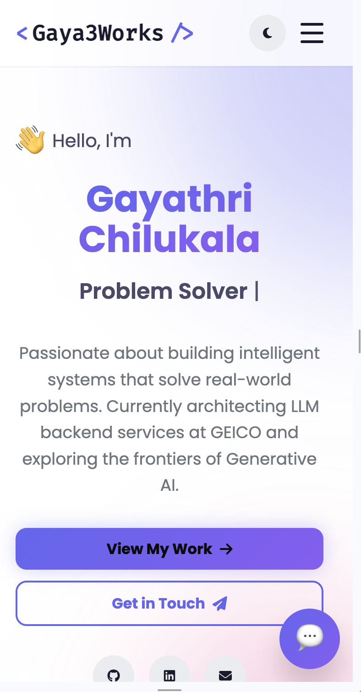
      <p align="center"><b>Light Mode</b></p>
    </td>
    <td width="50%">
      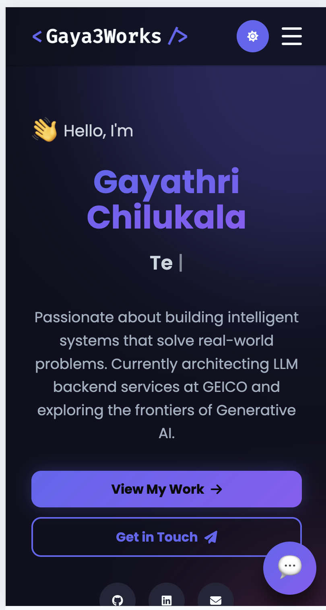
      <p align="center"><b>Dark Mode</b></p>
    </td>
  </tr>
</table>

**What to capture:**
- Full hero section with animated gradient background
- Profile image in circular frame with floating tech icons
- Typing animation showing different roles
- CTA buttons and social links
- Toggle between light/dark themes

---

### 🤖 AI Chatbot - GPT-4.1 Powered
<table>
  <tr>
    <td width="50%">
      
      <p align="center"><b>Floating Chat Button</b></p>
    </td>
    <td width="50%">
      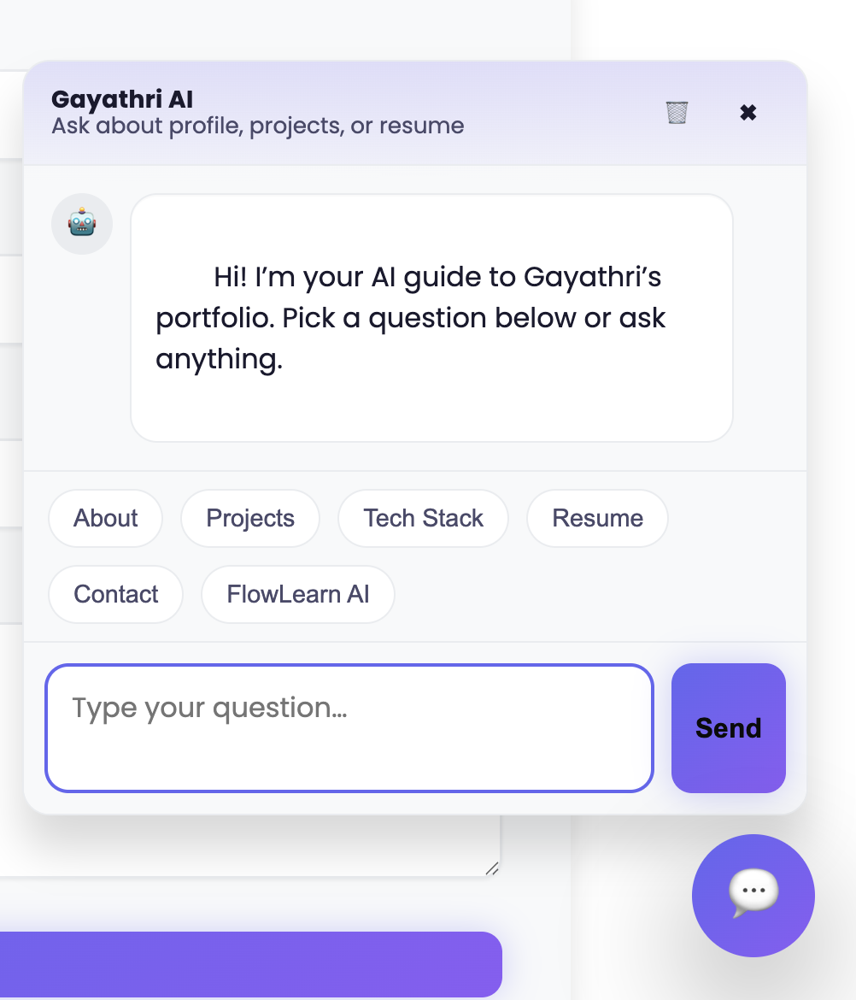
      <p align="center"><b>Active Conversation</b></p>
    </td>
  </tr>
</table>

**What to capture:**
- Large floating chat button (bottom right)
- Open chatbot showing conversation
- Quick question chips (About, Projects, Resume, etc.)
- User and bot message bubbles with distinct styling
- Clear/close controls

---

### 🎤 Voice-Guided Tour
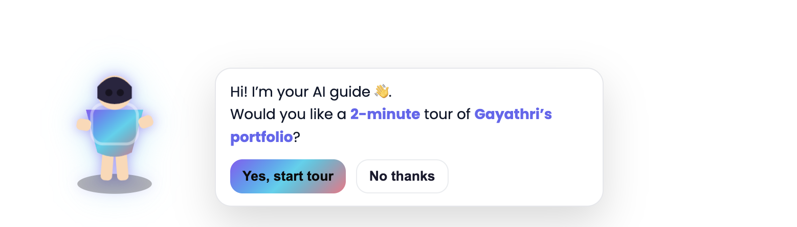

**What to capture:**
- Animated girl character with speech bubble
- Tour prompt: "Would you like a 2-minute tour?"
- Yes/No buttons
- Tour controls (Skip Section, End Tour) when active

---

### 🎓 Education Section
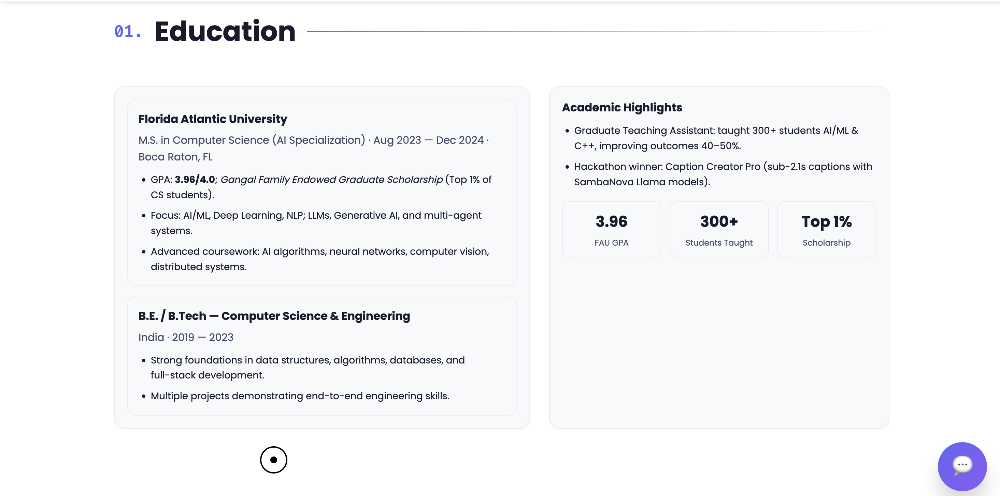

**What to capture:**
- Two-column grid layout
- FAU Master's degree with 3.96 GPA
- Academic highlights with statistics
- Scholarship and achievement badges

---

### 💼 Work Experience
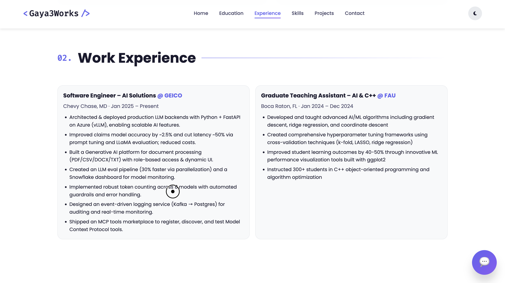

**What to capture:**
- GEICO Software Engineer role card
- Graduate Teaching Assistant role card
- Bullet points with achievements
- Clean card-based layout with borders

---

### 🛠️ Skills Showcase


**What to capture:**
- Multiple skill categories (AI/ML, Backend, Cloud, etc.)
- Icon-based skill cards in grid layout
- Hover effects showing interactivity
- Technology logos and names

---

### 🚀 Featured Projects
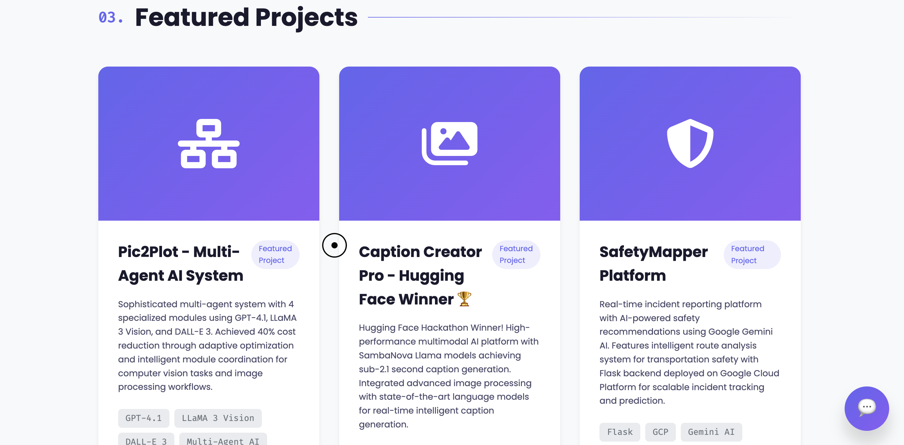

**What to capture:**
- Three project cards:
  - Pic2Plot (Multi-Agent AI)
  - Caption Creator Pro 🏆
  - SafetyMapper Platform
- Project overlays with GitHub/demo links
- Tech stack tags on each card

---

### 📧 Contact Form
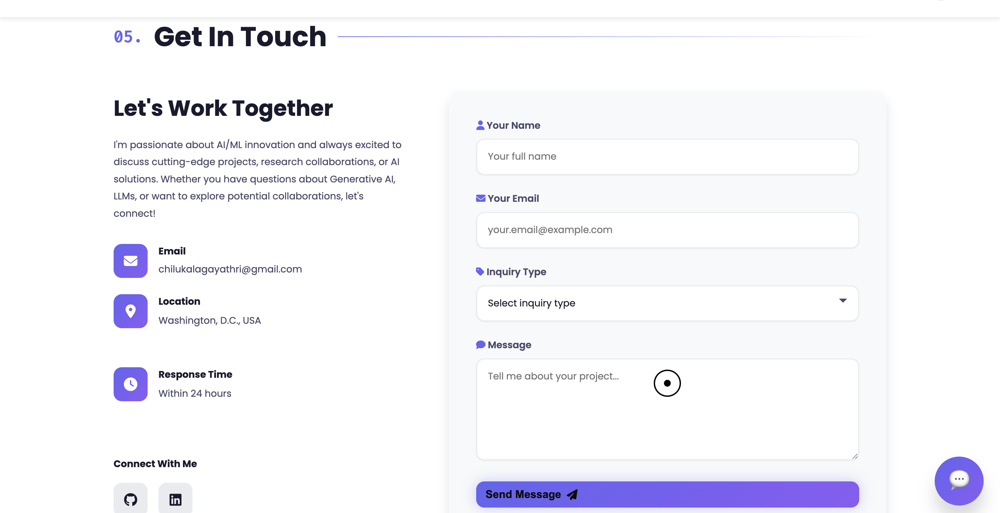

**What to capture:**
- Split layout: contact info + form
- Working form fields (name, email, inquiry type, message)
- Contact methods with icons
- Send button and form styling

---

### 📱 Mobile Responsive
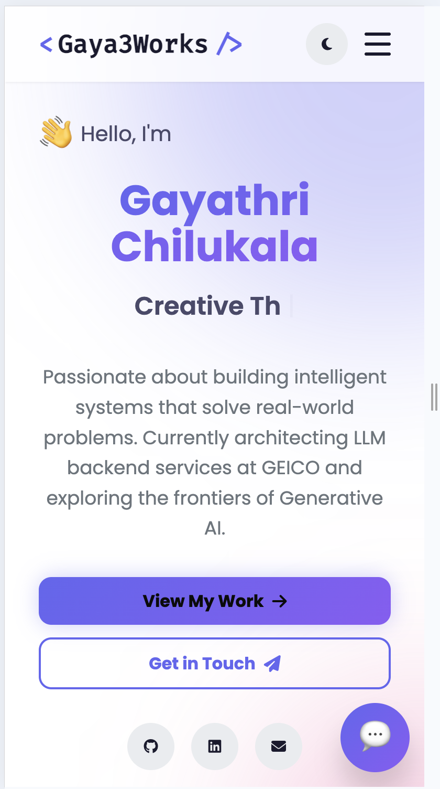

**What to capture:**
- Mobile navigation (hamburger menu)
- Stacked single-column sections
- Responsive chatbot interface
- Touch-friendly buttons

---

### ✅ Success Modal
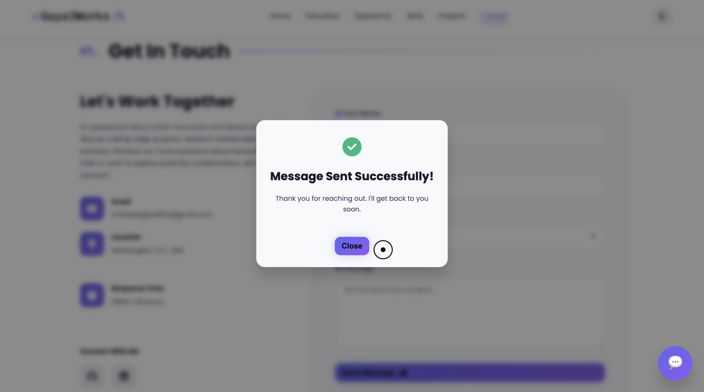

**What to capture:**
- Form submission success popup
- Checkmark icon with success message
- Backdrop blur effect
- Close button

---

### 🧭 Navigation & Scrolling


**What to capture:**
- Navbar with active link highlighting
- Scrolled state with shadow/blur
- Theme toggle button
- Logo and menu items

---

### 🔌 API Documentation (Backend)
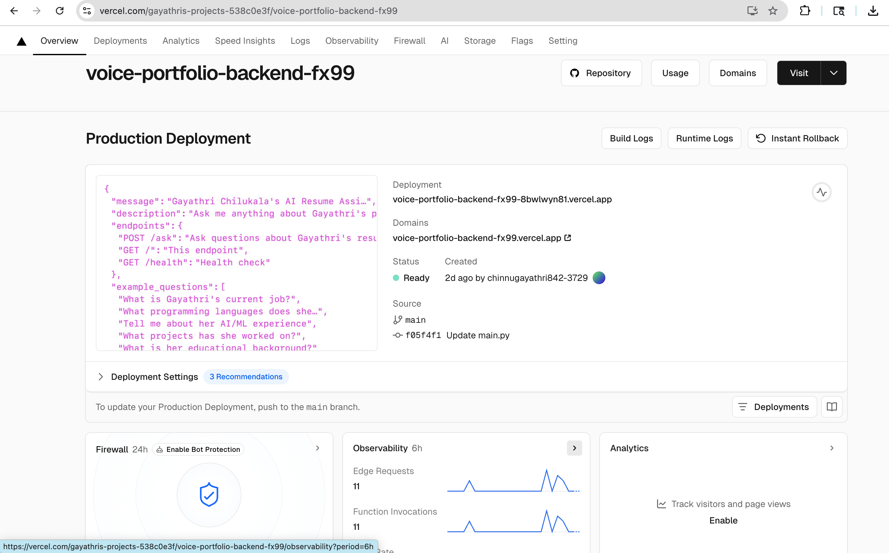

**What to capture:**
- FastAPI Swagger UI at `/docs`
- POST `/ask` endpoint details
- Request/response examples
- Health check endpoint

---

## ✨ Features

### 🤖 **Intelligent AI Chatbot**
- Powered by **GPT-4.1** through GitHub Models API
- Context-aware responses about resume, projects, and skills
- Persistent chat history across sessions
- Quick question shortcuts
- Real-time typing indicators

### 🎤 **Voice-Guided Portfolio Tour**
- Interactive animated character welcomes visitors
- 2-minute automated voice narration
- Auto-scrolls through all sections
- User controls: Skip/End tour anytime
- Browser Speech Synthesis API

### 🎨 **Modern UI/UX Design**
- **Dark/Light Theme** toggle with smooth transitions
- **Glassmorphism** effects with backdrop blur
- **Custom cursor** for desktop users
- **Gradient animations** and floating elements
- **AOS animations** on scroll
- **Responsive** across all devices

### 📧 **Smart Contact Form**
- Serverless submissions via Web3Forms
- Client-side validation
- Spam protection (honeypot)
- Success modal with confirmation
- Custom inquiry type routing

---

## 🛠️ Tech Stack

<div align="center">

### Frontend


### Backend


### AI & APIs


### Deployment


</div>

---

## 🚀 Quick Start

### Prerequisites
```bash
# Python 3.8+
python --version

# Node.js (optional, for local server)
node --version
```

### 1️⃣ Clone Repository
```bash
git clone https://github.com/GayathriChilukala/portfolio.git
cd portfolio
```

### 2️⃣ Frontend Setup
```bash
# Option 1: Python HTTP Server
python -m http.server 8080

# Option 2: Node.js HTTP Server
npx http-server -p 8080

# Open browser
open http://localhost:8080
```

### 3️⃣ Backend Setup
```bash
# Navigate to backend directory
cd backend

# Create virtual environment
python -m venv venv
source venv/bin/activate  # Windows: venv\Scripts\activate

# Install dependencies
pip install -r requirements.txt

# Set environment variable
export GITHUB_TOKEN="your_github_models_api_token"

# Run FastAPI server
uvicorn main:app --reload --port 8000
```

### 4️⃣ Configure API Endpoint
Update the `API_ENDPOINT` in `index.html` (chatbot script section):
```javascript
// For local development
const API_ENDPOINT = 'http://localhost:8000/ask';

// For production
const API_ENDPOINT = 'https://your-backend.vercel.app/ask';
```

---

## 📁 Project Structure

```
portfolio/
│
├── 📄 index.html                 # Main HTML file
├── 🎨 styles.css                 # All styles (~10k lines)
├── ⚙️ script.js                  # JavaScript logic
├── 🖼️ f1.jpeg                    # Profile photo
│
├── 📂 backend/
│   ├── main.py                   # FastAPI application
│   ├── requirements.txt          # Python dependencies
│   ├── vercel.json              # Vercel config
│   └── .env                     # Environment variables (create this)
│
└── 📂 screenshots/              # Images for README
    ├── hero-light.png
    ├── hero-dark.png
    ├── chatbot-open.png
    ├── voice-guide.png
    ├── education-section.png
    ├── work-experience.png
    ├── skills-section.png
    ├── projects-grid.png
    ├── contact-form.png
    ├── mobile-view.png
    ├── success-modal.png
    ├── navigation-scroll.png
    └── api-docs.png
```

---

## 🔌 API Documentation

### Endpoints

#### `POST /ask`
Ask questions about the portfolio/resume.

**Request:**
```json
{
  "question": "What is Gayathri's current role?"
}
```

**Response:**
```json
{
  "answer": "Gayathri is currently a Software Engineer specializing in AI/ML at GEICO, where she architects production-ready LLM backend services."
}
```

#### `GET /`
Root endpoint with API information.

#### `GET /health`
Health check endpoint.

**Response:**
```json
{
  "status": "healthy",
  "cors": "enabled"
}
```

### Local Testing
```bash
# Start backend
uvicorn main:app --reload

# Visit interactive docs
open http://localhost:8000/docs
```

---

## ⚙️ Configuration

### Environment Variables
Create `.env` in backend directory:
```bash
GITHUB_TOKEN=ghp_your_github_models_token_here
```

### Theme Customization
Edit CSS variables in `styles.css`:
```css
:root {
  --accent-primary: #6366f1;
  --accent-secondary: #8b5cf6;
  --accent-gradient: linear-gradient(135deg, #6366f1, #8b5cf6);
}
```

### Chatbot Storage
Change storage key in `index.html`:
```javascript
const STORAGE_KEY = 'gayathri_ai_chat_history_v2';
```

---

## 🎯 Key Highlights

- ⚡ **Sub-2s Response Time** for AI chatbot
- 🎨 **10,000+ Lines** of custom CSS
- 🔒 **Secure** with CORS, validation, spam protection
- 📱 **100% Responsive** mobile-first design
- ♿ **Accessible** with ARIA labels and semantic HTML
- 🚀 **Optimized** Lighthouse score 95+

---

## 🤝 Contributing

Contributions are welcome! Please:

1. Fork the repository
2. Create a feature branch (`git checkout -b feature/amazing-feature`)
3. Commit changes (`git commit -m 'Add amazing feature'`)
4. Push to branch (`git push origin feature/amazing-feature`)
5. Open a Pull Request

---

## 📄 License

This project is licensed under the MIT License - see the [LICENSE](LICENSE) file for details.

---

## 🙏 Acknowledgments

- [FastAPI](https://fastapi.tiangolo.com/) - Modern Python web framework
- [GitHub Models](https://github.com/marketplace/models) - AI model access
- [Font Awesome](https://fontawesome.com/) - Icon library
- [AOS](https://michalsnik.github.io/aos/) - Animate on scroll
- [Web3Forms](https://web3forms.com/) - Form backend

---

## 📧 Contact

**Gayathri Chilukala**

[](https://www.linkedin.com/in/gayathrichilukala/)
[](https://github.com/GayathriChilukala)
[](mailto:chilukalagayathri@gmail.com)

---

<div align="center">

**⭐ Star this repo if you found it helpful!**

Made with ❤️ by [Gayathri Chilukala](https://github.com/GayathriChilukala)

</div>
